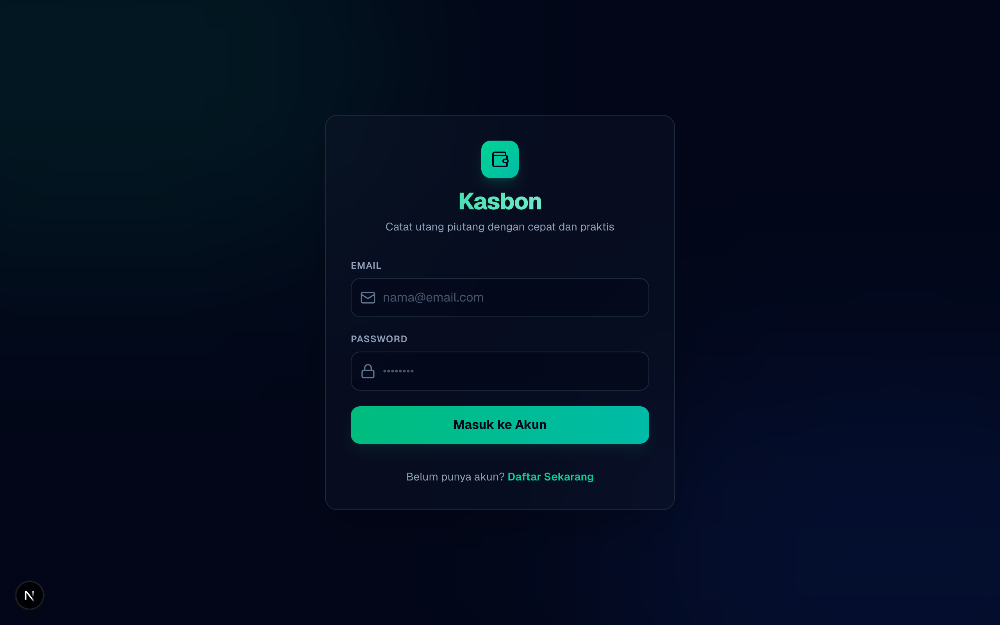

# Kasbon - Aplikasi Pelacak Utang Piutang

Halo! Ini adalah **Kasbon**, aplikasi web sederhana buat nyatet dan ngelacak utang piutang pribadi. Aplikasi ini dibikin dari nol pake Next.js, Tailwind v4, dan Supabase.



---

## 🚀 Fitur Utama

- **Login & Register**: Bikin akun pake email & password (aman pake Supabase Auth). Halaman dasbor cuma bisa diakses kalau udah login.
- **Dashboard Ringkasan**: Langsung keliatan total piutang (dihutang ke saya), total utang (saya hutang), sama selisih bersihnya (Net).
- **Visualisasi Chart (Bonus)**: Ada bar chart simpel di dashboard buat ngebandingin porsi utang vs piutang biar gampang diliat secara visual.
- **Filter & Cari (Bonus)**: Bisa cari nama orang, filter status (lunas/belum lunas), filter tipe transaksi, dan diurutin berdasarkan tanggal atau jumlah uang.
- **Tampilan Per Orang (Group by Person - Bonus)**: Terdapat pilihan toggle agar transaksi bisa dikelompokkan per nama orang secara rapi (bisa di-collapse).
- **Form Edit & Hapus**: Bisa edit atau hapus catatan kasbon kalau ada yang salah catat.
- **Responsif**: Tampilannya nyaman dibuka di HP maupun di laptop.

---

## 🛠️ Tech Stack yang Dipakai

- **Framework**: Next.js 16 (App Router)
- **Styling**: Tailwind CSS v4
- **Database & Auth**: Supabase (PostgreSQL + RLS)
- **Icons**: Lucide React
- **Language**: TypeScript (strict, no any)

---

## ⚙️ Cara Jalanin di Komputer Lokal

### 1. Install Dependensi
Jalankan install dependensi terlebih dahulu:
```bash
npm install
```

### 2. Setup Env Variables
Bikin file `.env.local` di root folder proyek ini, terus masukkan detail proyek Supabase:
```env
NEXT_PUBLIC_SUPABASE_URL=https://tzlbivfaacpkwrvqcsgw.supabase.co
NEXT_PUBLIC_SUPABASE_ANON_KEY=sb_publishable_obMsY6JBZpmngPUOv7fHsA_U_oR2dl4
```

### 3. Migrasi Database
Masuk ke dashboard Supabase, buka bagian **SQL Editor**, buat query baru, lalu salin dan jalankan isi file SQL berikut:
👉 [`supabase/migrations/20260612000000_create_debts_table.sql`](supabase/migrations/20260612000000_create_debts_table.sql)

Ini bakal otomatis bikin tabel `debts`, pasang validasi (kayak max 200 karakter buat catatan), nyalain **Row Level Security (RLS)** biar data nggak bocor antar user, dan bikin trigger update tanggal otomatis.

### 4. Jalankan Aplikasi
Jalankan perintah berikut:
```bash
npm run dev
```
Buka browser di **[http://localhost:3000](http://localhost:3000)**.

---

## 🔗 Link Demo (Vercel)
Link deploy aplikasi: **[https://kasbon-tracker.vercel.app](https://kasbon-tracker.vercel.app)** *(bisa di-update setelah dideploy)*

## 💡 Keputusan Teknis yang Saya Banggakan
Saya bangga dengan fitur **Group by Person** dan **Visual Bar Chart**-nya. Datanya diolah di sisi klien biar transisi dari daftar biasa ke grup terasa instan tanpa delay. Bar chart-nya juga dibuat murni pakai CSS Tailwind v4 tanpa library luar biar aplikasi tetap ringan saat dibuka di HP.

---

## ⏳ Kalau Ada Waktu 1 Hari Lagi, Mau Nambahin Apa? (Trade-offs)
Saya ingin menambahkan fitur pengingat jatuh tempo otomatis (misalnya lewat email atau WhatsApp) untuk setiap catatan kasbon yang belum lunas dan sudah melewati tanggal jatuh temponya.

---

## ⏱️ Berapa Lama Ngerjainnya? (Time Spent)
Jujur pengerjaannya makan waktu sekitar **3 jam**. Ini udah termasuk setup Supabase, bikin API endpoints, benerin routing middleware buat protect page, bikin styling dashboard, sampai selesai ngerapihin error.
